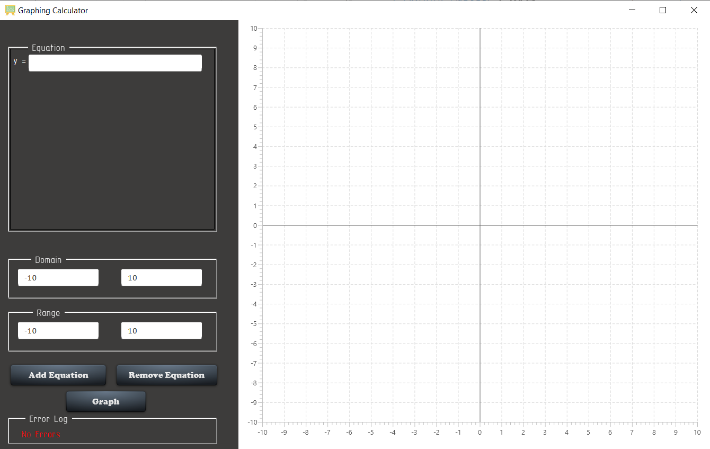
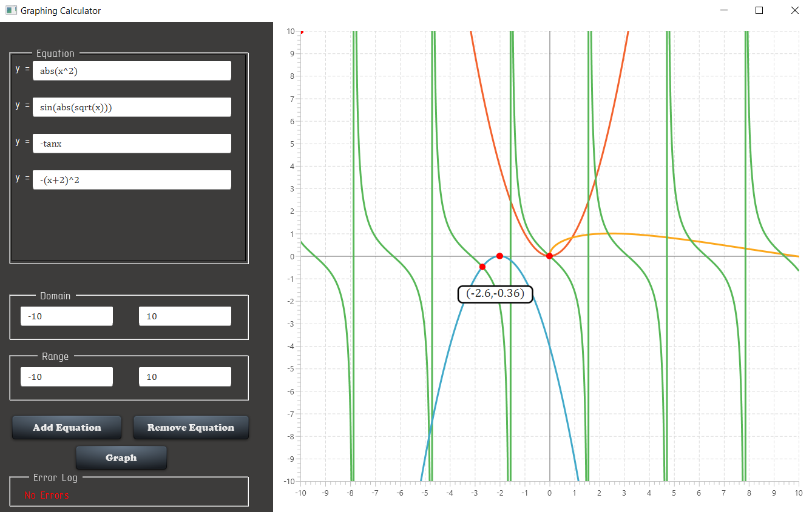
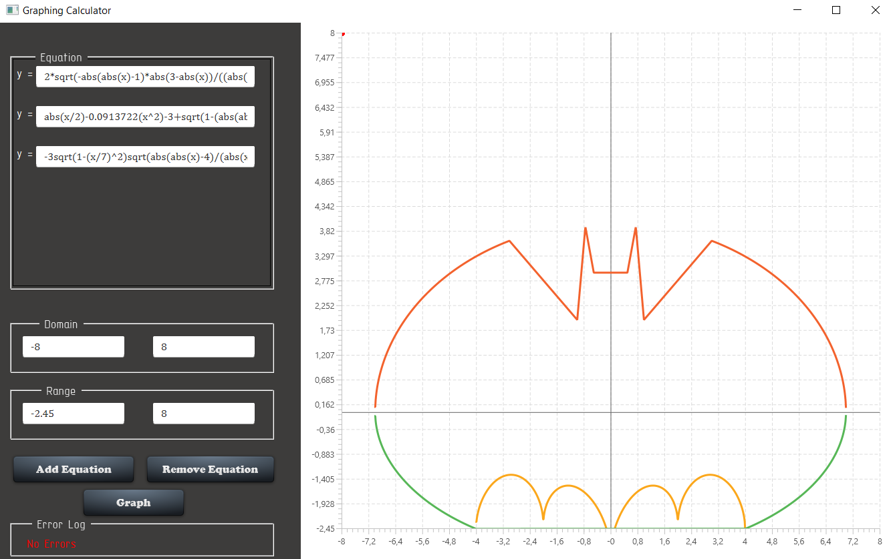

# Graph Plotter

This project was developed as a laboratory work on Software Engineering, but later grew into a unique project that contains a primitive implementation of a graph plotter, that developed using JavaFX.

## Prerequisites

1. [IntelliJ IDEA](https://www.jetbrains.com/idea/download/#section=windows)
2. [Basic knowledge in Design Patterns](https://refactoring.guru/design-patterns)

## Functionality
The graph plotter contains the following features:

- [x] Add and display graphs given relative to `y`.
- [x] Ability to add, remove and display multiple graphs
- [x] Specify the interval of the graph
- [x] Error display

In general, everything is based on the `Decorator`, `Prototype` and `Visitor` patterns.

## Example of project performance

    

    

    

